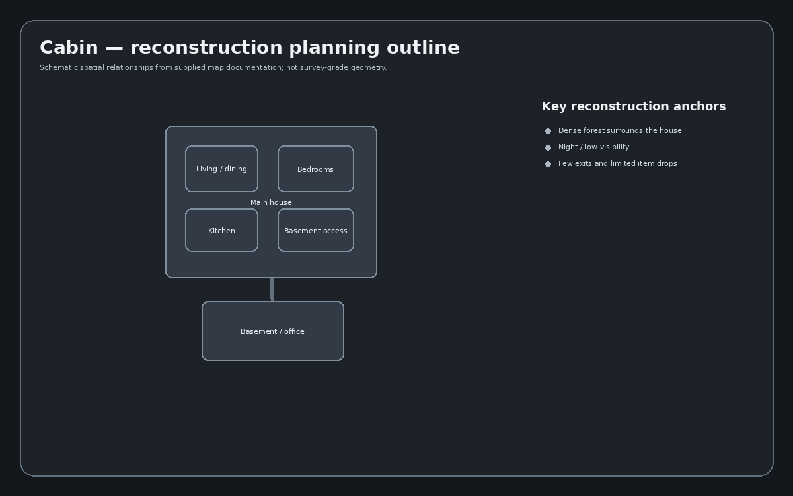

# Cabin reconstruction dossier

## Release identity

- **Release mode:** Regular, 15 waves
- **Environment / skybox:** Night
- **World location:** Forest location; exact region undocumented
- **Supported objective families:** Load, Repair, Radio, Unpack, Escort
- **Collectibles / easter-egg references:** Spiffo plush; wooden statue

## What the reconstruction must preserve

*Source: Cabin.wiki*

- **In-game tag line:** "THE MOST DIFFICULT MAP" (Cabin Update thumbnail).
- **Layout character:** a large house in the middle of a forest. **Set at night, dark, with poor visibility.**
- **Landmarks / rooms:** nursery (crib and furniture, light-blue wallpaper decorated with sailboats);
  bathroom next to the nursery; master bedroom with two entrances, a large bed facing a television and
  a wardrobe in the corner; living room (piano, two sofas facing a large fireplace mantle) connected to
  the dining room and to the basement access way; kitchen; **basement — the largest room in the house**,
  an empty room cluttered with unorganized boxes and crates, supported by several pillars; a basement
  office lined with bookshelves on all sides and a computer on a desk. Outside is a large open field
  thickly wooded with coniferous trees, with a small opening path leading out through the forest.
- **Infected spawns:** in the forest, at all directions of the map.
- **Map-specific mechanics / details:** the house has **limited item drops and few escape routes**;
  at higher waves it is recommended to **ignore objectives** entirely on this map.

## Engine scaffold

Each map is reconstructed as five independently verifiable layers:

1. **Static art** — terrain, structures, props, decals, signs, vegetation and background dressing.
2. **Collision + navigation** — player collision, infected barriers, pathfinding modifiers, traversal blockers and drop-offs.
3. **Gameplay anchors** — player starts, infected spawns, item boxes, objective anchors, fortification positions and helicopter/supply-drop support points where applicable.
4. **Environment** — sky, fog/atmosphere, color grading, lights, local/environment sounds and weather presentation.
5. **Map metadata** — map name, voting card/icon, objective support, mode restrictions and reconstruction validation data.

## Named locations visible in supplied reference material

- Basement
- BasementEntrance
- Bedroom
- DiningRoom
- Kitchen
- LivingRoom
- M92
- Nursery
- Office
- Statue
- Campgrounds Cabin
- Campgrounds Cabin2
- Mill SecurityCabin

This list is a **reference-asset inventory**, not a claim that every map instance has already been extracted. The source-map conversion pass remains the authority for the final instance-by-instance inventory.

## Reference image files indexed (18)

- `Cabin-Basement.png`
- `Cabin-BasementEntrance.png`
- `Cabin-Bedroom.png`
- `Cabin-DiningRoom.png`
- `Cabin-Kitchen.png`
- `Cabin-LivingRoom.png`
- `Cabin-M92.png`
- `Cabin-Nursery.png`
- `Cabin-Office.png`
- `Cabin-Statue.png`
- `CabinIcon.png`
- `Cabin_Update.PNG`
- `Campgrounds-Cabin.jpg`
- `Campgrounds-Cabin2.jpg`
- `Card-cabin.png`
- `Mill-SecurityCabin.png`
- `SpiffoCabin.png`
- `Vote-cabin.png`

## Build sequence

- [ ] Freeze/hash source map and associated evidence.
- [ ] Extract hierarchy, transforms, dimensions, materials, collision and named anchors.
- [ ] Generate a machine-readable instance inventory.
- [ ] Generate top-down bounds/outlines from extracted geometry.
- [ ] Build engine-neutral asset mapping and resolve external dependencies.
- [ ] Reconstruct static scene in Godot.
- [ ] Add collision/navigation and validate traversal.
- [ ] Add spawn, item and objective anchors.
- [ ] Recreate lighting, atmosphere and audio zones.
- [ ] Run visual/fidelity comparisons against supplied captures.
- [ ] Run gameplay acceptance tests and record known deviations.

## Completion evidence expected

A map is not considered reconstructed merely because it renders. Completion requires a source manifest, normalized scene data, top-down diagram, instance/asset inventory, collision/nav validation, spawn/objective validation, comparison captures, automated tests where possible, and a written deviation log.
