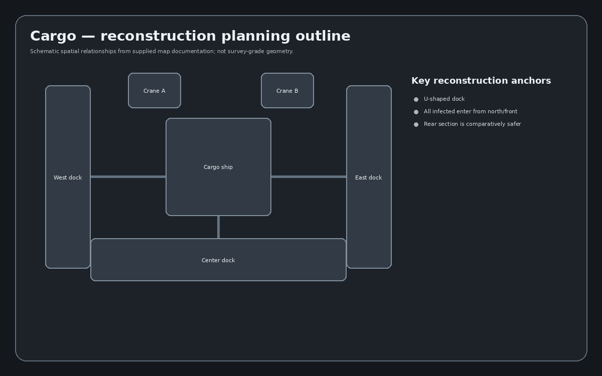

# Cargo reconstruction dossier

## Release identity

- **Release mode:** Regular, 15 waves
- **Environment / skybox:** Night
- **World location:** Indianapolis, Indiana, USA
- **Supported objective families:** Load, Repair, Radio, Unpack, Damage, Escort
- **Collectibles / easter-egg references:** Spiffo plush; wooden statue

## What the reconstruction must preserve

*Source: Cargo.wiki*

- **Layout character:** a narrow port along a body of water — a large **U-shaped dock** connected to a
  **cargo ship in the centre**. Explicitly described as a **linear structure**.
- **Landmarks:** storage containers littering the map; **two large cranes** hanging overhead on the
  docks; military and medical tents in the northern front of the dock; an inaccessible delivery
  entrance and an inaccessible parking lot; west dock, east dock, centre dock, ship front deck and
  ship rear deck.
- **Infected spawns:** **all infected spawn at the northern front of the map**, entering past openings
  where fences are not present — two on front and one on each side.
- **Map-specific mechanics / details:**
  - Because all infected come from the front, the back section is safer and items/fortifications also
    spawn frequently in the back.
  - Infected can roam **both sides of the dock**, so a split team gets flanked.
  - The end of the cargo ship is a turtle spot with limited chokepoints but **few item spawn locations**.
  - Because of the linear structure, infected walk in a trail — high-penetration weapons (Barrett M82A1,
    Winchester Model 1892) are called out.

## Engine scaffold

Each map is reconstructed as five independently verifiable layers:

1. **Static art** — terrain, structures, props, decals, signs, vegetation and background dressing.
2. **Collision + navigation** — player collision, infected barriers, pathfinding modifiers, traversal blockers and drop-offs.
3. **Gameplay anchors** — player starts, infected spawns, item boxes, objective anchors, fortification positions and helicopter/supply-drop support points where applicable.
4. **Environment** — sky, fog/atmosphere, color grading, lights, local/environment sounds and weather presentation.
5. **Map metadata** — map name, voting card/icon, objective support, mode restrictions and reconstruction validation data.

## Named locations visible in supplied reference material

- CenterDock
- DeliveryEntrance
- EastDock
- ParkingLot
- ShipFront
- ShipRear
- Statue
- WestDock

This list is a **reference-asset inventory**, not a claim that every map instance has already been extracted. The source-map conversion pass remains the authority for the final instance-by-instance inventory.

## Reference image files indexed (27)

- `Card-cargo.png`
- `Cargo-CenterDock.png`
- `Cargo-DeliveryEntrance.png`
- `Cargo-EastDock.png`
- `Cargo-ParkingLot.png`
- `Cargo-ShipFront.png`
- `Cargo-ShipRear.png`
- `Cargo-Statue.png`
- `Cargo-WestDock.png`
- `Cargo.jpeg`
- `CargoIcon.png`
- `EarlyCargo.jpg`
- `EarlyCargo2.jpg`
- `EarlyCargo3.png`
- `OldCargo.png`
- `OldCargo2.jpg`
- `OldCargo3.jpeg`
- `OldCargo4.png`
- `OldCargo5.png`
- `OldCargo6.png`
- `OldCargo7.png`
- `OldCargo8.png`
- `OldCargoFire.png`
- `OldCargoShowcase.png`
- `OldCargoSniper.png`
- `Spiffo_on_Cargo.PNG`
- `Vote-cargo.png`

## Build sequence

- [ ] Freeze/hash source map and associated evidence.
- [ ] Extract hierarchy, transforms, dimensions, materials, collision and named anchors.
- [ ] Generate a machine-readable instance inventory.
- [ ] Generate top-down bounds/outlines from extracted geometry.
- [ ] Build engine-neutral asset mapping and resolve external dependencies.
- [ ] Reconstruct static scene in Godot.
- [ ] Add collision/navigation and validate traversal.
- [ ] Add spawn, item and objective anchors.
- [ ] Recreate lighting, atmosphere and audio zones.
- [ ] Run visual/fidelity comparisons against supplied captures.
- [ ] Run gameplay acceptance tests and record known deviations.

## Completion evidence expected

A map is not considered reconstructed merely because it renders. Completion requires a source manifest, normalized scene data, top-down diagram, instance/asset inventory, collision/nav validation, spawn/objective validation, comparison captures, automated tests where possible, and a written deviation log.
