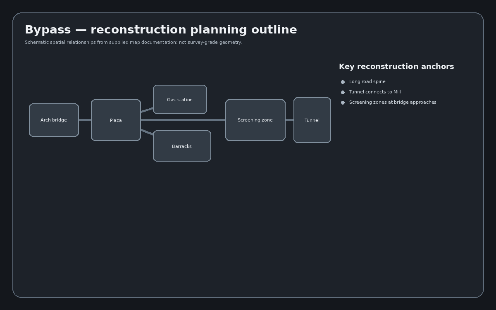
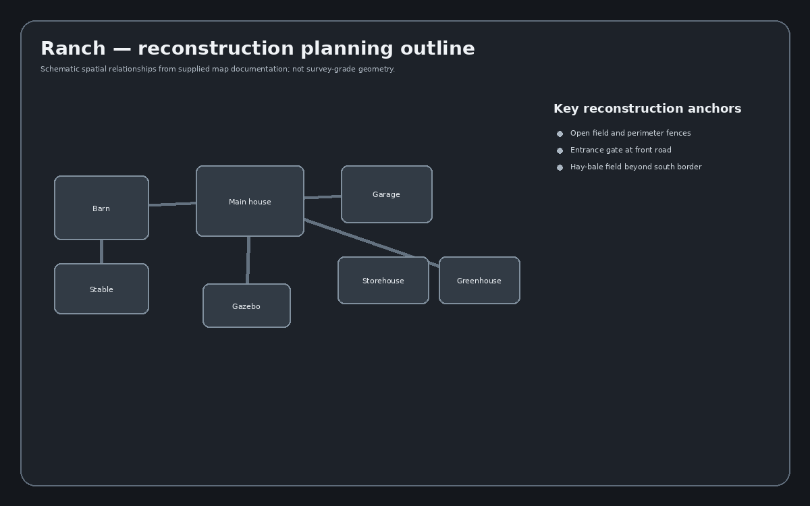
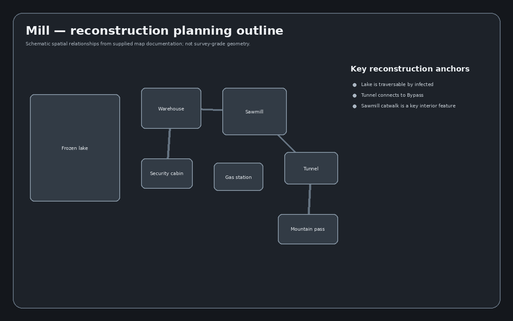
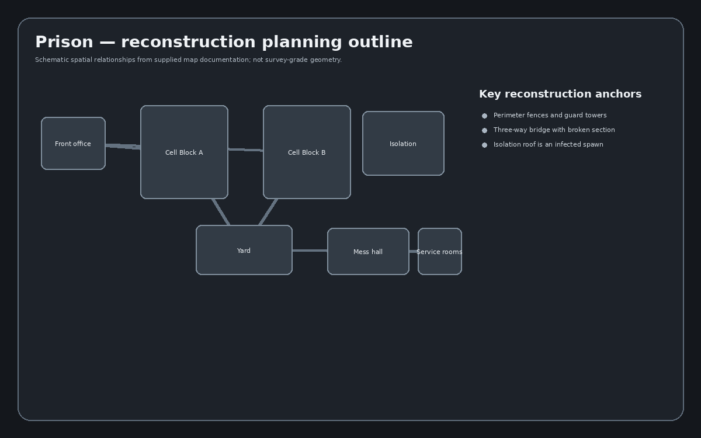
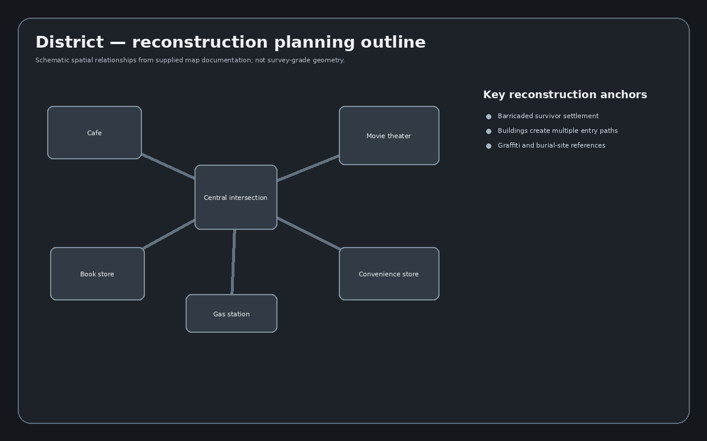
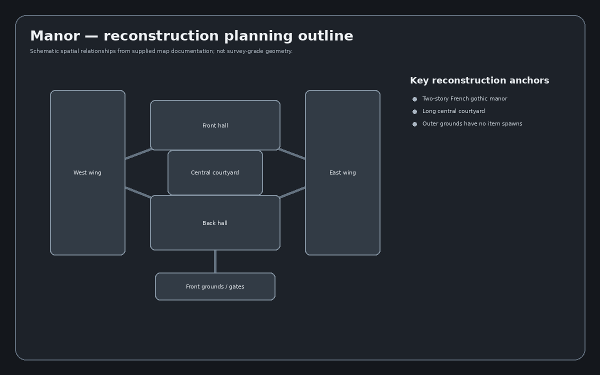
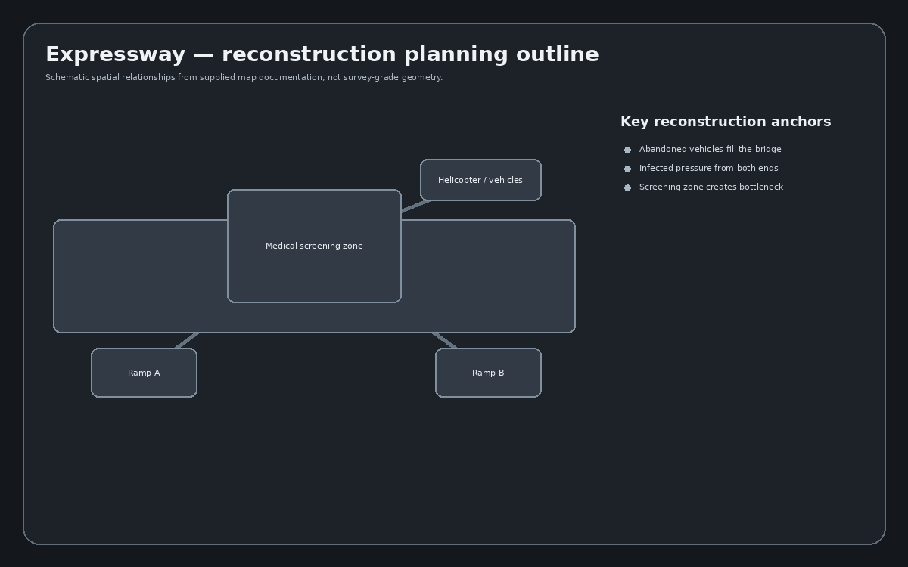
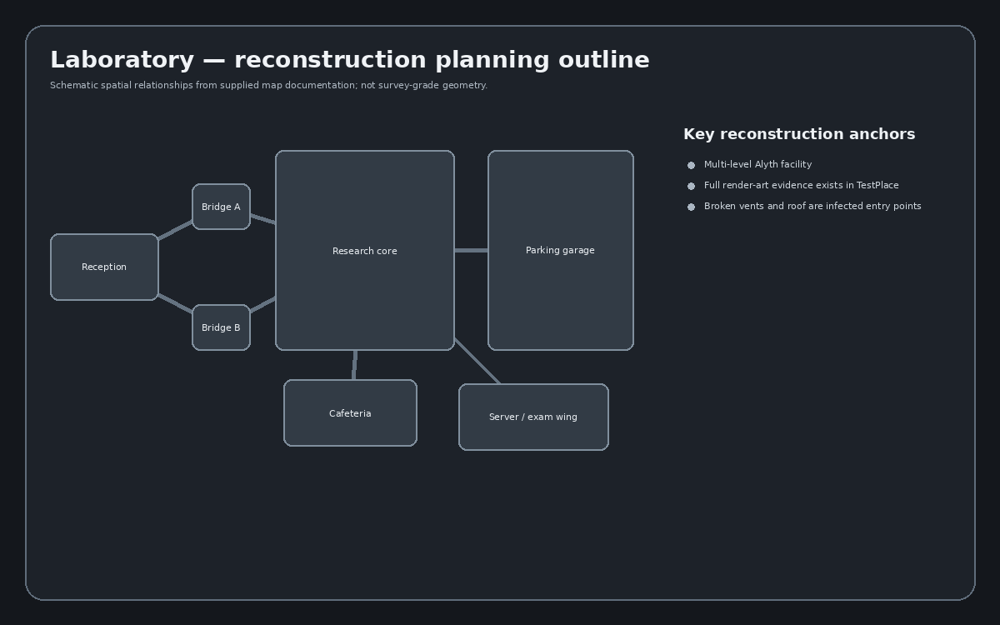

# Map Reconstruction Index

This directory documents the ten maps in the locked offline release scope. Each dossier records source authority, map identity, objectives, collectible/easter-egg references, visual evidence, reconstruction layers, and verification work.

> The PNG outline is a reconstruction-planning schematic. It is not presented as a surveyed architectural floor plan unless a source layout image explicitly supports that claim.

## [Bypass](BYPASS.md)

- Skybox: **Cloudy Sunset**
- Objectives: Load, Repair, Radio, Unpack, Damage, Escort
- Reference captures/files indexed: **31**

## [Ranch](RANCH.md)

- Skybox: **Sunrise**
- Objectives: Load, Repair, Radio, Unpack, Escort
- Reference captures/files indexed: **38**

## [Mill](MILL.md)

- Skybox: **Snowy**
- Objectives: Load, Repair, Radio, Unpack, Damage, Escort
- Reference captures/files indexed: **17**

## [Prison](PRISON.md)

- Skybox: **Sunrise**
- Objectives: Load, Repair, Radio, Unpack, Damage, Escort
- Reference captures/files indexed: **40**

## [Cabin](CABIN.md)

- Skybox: **Night**
- Objectives: Load, Repair, Radio, Unpack, Escort
- Reference captures/files indexed: **18**

## [District](DISTRICT.md)

- Skybox: **Sunset**
- Objectives: Load, Repair, Radio, Unpack, Damage, Escort
- Reference captures/files indexed: **32**

## [Cargo](CARGO.md)

- Skybox: **Night**
- Objectives: Load, Repair, Radio, Unpack, Damage, Escort
- Reference captures/files indexed: **27**

## [Manor](MANOR.md)

- Skybox: **Stormy Night**
- Objectives: Load, Repair, Radio, Unpack, Escort
- Reference captures/files indexed: **28**

## [Expressway](EXPRESSWAY.md)

- Skybox: **Cloudy**
- Objectives: Load, Repair, Radio, Unpack, Damage, Escort
- Reference captures/files indexed: **6**

## [Laboratory](LABORATORY.md)

- Skybox: **Night**
- Objectives: Load, Repair, Radio, Unpack, Escort
- Reference captures/files indexed: **81**
